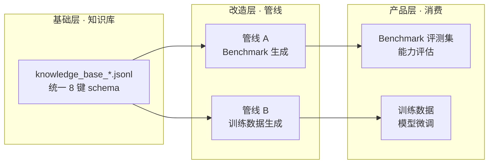

# 数据分层架构：知识库 → 改造 → Benchmark / 训练数据

> 本文档固化数据层的**架构定位**（用户决策 2026-08-07）：
> **知识库不是 benchmark，也不是训练数据；它是两者的共同基础（原料层）。**
> 从同一知识库出发，经过**不同的改造管线**，才能分别产出 benchmark 与训练数据。

---

## 〇、核心原则（一句话）

**知识库 = 原料（科学结论），benchmark / 训练数据 = 产品（不同改造的产物）。**
知识库只保证"结论正确、格式统一、可溯源"；下游用途（评测 or 训练）由改造方式决定，不由知识库本身决定。

---

## 一、三层定义

### L0 基础层：知识库（Knowledge Base）

| 属性 | 说明 |
|---|---|
| 本质 | 科学结论的**权威存储**，非直接可消费产品 |
| 内容 | claim 版本统一 schema（8 键：claim / claim_type / entities / evidence / reasoning_chain / experimental_context / confidence / metadata） |
| 当前构成 | `knowledge_base_clean.jsonl`（617 文献）＋ `knowledge_base_stat.jsonl`（633 统计）＋ `knowledge_base_gc_motif.jsonl`（33 GC-motif，`claim_type=gc_association`），去重后 656+ 条 |
| 质量保证 | 三层验证（statistical / consistency / expert）+ 两轮人工修正 |
| 不变量 | 结论正确、可溯源、格式统一；**不做**题目化、不做切分、不做增强 |

### L1 改造层：两条管线（当前**未实现**，仅定义）

| | 管线 A：Benchmark 生成 | 管线 B：训练数据生成 |
|---|---|---|
| 目标 | 能力**评估**（可判分、可比） | 模型**训练**（可学习、可泛化） |
| 问题形态 | 封闭式（选择/填空/判断，**标准答案唯一**） | 开放式（指令 + 自由生成） |
| 关键改造 | ①题目化（知识→问题/答案对）②干扰项构造 ③金标答案标注 ④**防泄漏切分**（train/eval 集分离，实体级去重）⑤难度分层（L1-L5） | ①指令化（模板填充）②LLM 增强（润色/推理链扩展）③同义改写与多样性 ④质量过滤 ⑤分布均衡 |
| 验收标准 | pass@k 可复现、无泄漏、区分度（7B vs 32B 可辨） | 增强后质量分、多样性、与知识库一致性 |

### L2 产品层：消费对象

- **Benchmark**：用于评测模型能力（如现有 L3 推理评测 88.5 vs 87.9），要求答案可判分。
- **训练数据**：用于微调模型（如现有 enhanced_full2.jsonl **908 条**），要求多样、均衡、正确。

---

## 二、当前实现状态归属（对照）

| 现有产物 | 归属层 | 说明 |
|---|---|---|
| `data/processed/knowledge_base_*.jsonl` | **L0 知识库** | 已完成（617+633+33） |
| `templates/L*.yaml`（17 个模板） | **L1 管线 B 的一部分** | 指令化改造 |
| `src/data_synthesis/template_engine.py` | **L1 管线 B 的一部分** | 模板填充 + 轮询采样 |
| `src/data_synthesis/llm_enhancer.py` | **L1 管线 B 的一部分** | LLM 增强（L1/L2 规则直出 + L3/L4/L5 LLM 生成） |
| `data/synthetic/drafts_full2.jsonl` / `enhanced_full2.jsonl` | **L2 管线 B 产物（训练数据雏形）** | **908 条**（896 基础 + 12 GC），统一 9 键 schema（见附录） |
| `data/synthetic/drafts_gc.jsonl` / `enhanced_gc.jsonl` | **L1 管线 B 的一部分** | GC-motif 草稿/增强（12 条：L2_003×4 + L2_004×4 + L3_004×4，id 加 `GC_` 前缀避免冲突） |
| 7B/32B L3 评测（88.5 / 87.9） | **L2 管线 A 的临时验证** | 用模板草稿临时评测，非正式 benchmark |

**训练数据产物 schema（已固化，2026-08-07 统一）**：

`enhanced_full2.jsonl` 每条记录**强制统一 9 键**，任一记录缺任一键即视为格式违规：

| 顶层键 | 说明 |
|---|---|
| `id` | 唯一 ID（模板前缀 + 序号，如 `L1_001_1`） |
| `level` | 难度分层 L1-L5 |
| `template_id` | 来源模板（如 `L1_001`） |
| `instruction` | 指令（模板填充生成，含 `{claim_text}` 等） |
| `input` | 输入（当前统一空串） |
| `output` | 答案（L1/L2 规则直出或 L3/L4/L5 LLM 生成） |
| `raw_output_placeholder` | 原始输出占位（当前统一空串） |
| `direct` | **生成方式标志**：`true`=规则直出（L1/L2），`false`=LLM 生成（L3/L4/L5） |
| `metadata` | 8 键：`source_claim_ids` / `claim_type` / `entities_used` / `evidence` / `reasoning_chain` / `gene_specific` / `llm_model` / `quality_score` |

可溯源不变量：**每条的 `metadata.source_claim_ids` 必须非空**（指向知识库 claim）。
生成方式双标志：顶层 `direct` 记录直出/LLM，`metadata.llm_model` 记录具体模型（`rule`=规则直出 / `Qwen2.5-32B-AWQ` 等）。

> 注：`direct` 曾因 `scripts/regen_l12_l4.py` 只给 L1/L2 写 `true` 而缺失于 L3/L4/L5（格式不统一，512 条无此键），已于 2026-08-07 归一化修复：全部 896 条补齐 `direct`（384 true / 512 false），且 L1/L2 的 `llm_model` 空串统一为 `rule`。

**GC-motif 层接入**（2026-08-07 完成）：12 条 GC 增强（`enhanced_gc.jsonl`）已并入，数据集扩至 **908 条**（L1=192 / L2=200 / L3=196 / L4=192 / L5=128），顶层键仍唯一（`direct: 392 true / 516 false`）。`llm_enhancer.py` 新增 `direct_answer_L2_004` 直出规则（GC 富集方向 → GC 含量偏好）。

**关键结论**：
1. 现有流程整体归属**管线 B（训练数据）**，且已跑通（896 条）。
2. 管线 A（Benchmark）**尚未正式实现**：封闭式题目化、干扰项、防泄漏切分、金标答案标注都未做。
3. 此前用草稿直接评测 7B/32B，属于**临时验证手段**，不等同于正式 benchmark——正式 benchmark 需要管线 A 的产物。

---

## 三、两条管线的差异清单（从同一知识库出发）

### 相同点
- 输入：同一 `knowledge_base_*.jsonl`
- 都要求：结论正确、溯源保留（metadata.source_claim_ids）
- 都按 L1-L5 分层

### 差异点（重点）

| 维度 | 管线 A（Benchmark） | 管线 B（训练数据） |
|---|---|---|
| 答案 | 封闭、唯一、可自动判分 | 开放、多样、无唯一答案 |
| 防泄漏 | **必须**（实体级去重，train/eval 分离） | 宽松（只需不重复） |
| 干扰项 | 构造（同实体异结论 / 同结论异实体） | 不需要 |
| 金标 | 每条问题带标准答案 + 评分要点 | 无（靠质量过滤） |
| 增强 | 禁止 LLM 改写答案（保金标） | LLM 增强是核心步骤 |
| 产出格式 | question / options / gold_answer / eval_id | instruction / input / output / metadata |
| 判分方式 | 精确匹配 / 选项命中 / 要点命中 | 质量分 / 人工抽检 |

---

## 四、演进建议（状态跟踪）

1. **固化 L0**：✅ 已完成（2026-08-07）——GC-motif 层 33 条（`gc_association`）已正式入库 `knowledge_base_gc_motif.jsonl`，模板引擎已支持该 claim 类型。
2. **管线 B 完善**：✅ 已完成（2026-08-07）——`drafts_gc.jsonl`（12 条 GC 草稿：L2_003×4 + L2_004×4 + L3_004×4）已增强并入 `enhanced_full2.jsonl`（现 **908 条**），覆盖补齐。
3. **格式统一**：✅ 已完成（2026-08-07）——`enhanced_full2.jsonl` 全部 896 条统一 9 键 schema + 可溯源（`source_claim_ids` 全覆盖）；生成脚本（`llm_enhancer.py` / `regen_l12_l4.py`）已同步修正，防止复现。
4. **管线 A 立项**（需要时）：设计封闭式问题模板、干扰项构造器、防泄漏切分器、金标标注格式。

---

## 五、术语表

| 术语 | 定义 |
|---|---|
| 知识库（KB） | L0 原料层：统一 schema 的科学结论集合 |
| 改造（Transformation） | 从 KB 到产品的转化过程（题目化 / 指令化 / 增强等） |
| Benchmark | L2 产品：可判分的封闭式评测集，用于能力评估 |
| 训练数据 | L2 产品：开放式指令数据，用于模型微调 |
| 防泄漏切分 | 管线 A 特有的 train/eval 分离，按实体/claim 去重避免同知识出现在两侧 |

---

*文档状态：定位固化稿（用户决策 2026-08-07）。管线实现另行立项，本文不包含实现细节。*
